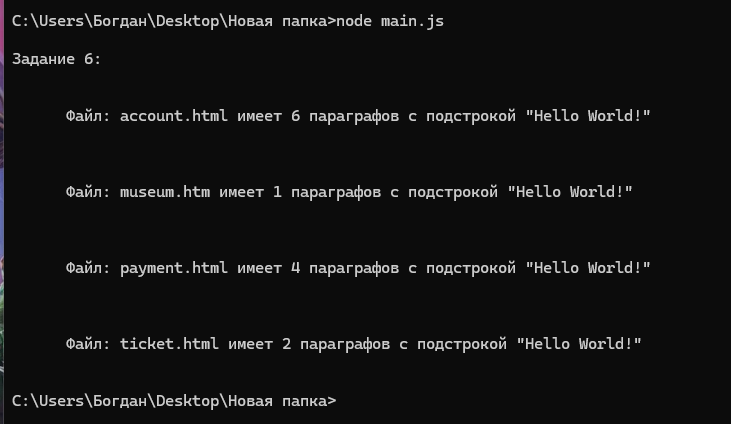

**Дано задание:**

  -Используйте документацию (https://nodejs.org/dist/latest-v16.x/docs/api/, точнее описание использования модуля "fs" https://nodejs.org/dist/latest-v16.x/docs/api/fs.html) для создания модуля (файла "*.js") который будет
  выполнять следующие действия:

     1) получать список всех файлов '*.html' и '*.htm' в некоторой папке (путь к папке можно захардкодить в константу в шапке модуля) (см. fs.readdir / fs.readdirSync);

     2) читать каждый файл полученный в п.1 (см. fs.readFile / fs.readFileSync);

     3) разбирать прочитанный файл, получать информацию о количестве параграфов (тегов <P ...>...</P>) содержащих некоторую подстроку (строку можно захардкодить в константу в шапке модуля);

     4) выводить статистику собранную в п.3 в консоль (console.log(...)) с указанием имени файла в котором собрана эта статистика.

**Чтобы выполнить это задание - я создам модуль main.js, который будет выполнять всю логику работы с файлами:**

  ```
  const fs = require('fs'); // Для работы с файловой системой
  const path = require('path'); // Для работы с путями файлов и директорий
  const cheerio = require('cheerio'); // Для парсинга HTML-документов

  const DIR_PATH = './fragment'; // Директория, в которой ищем файлы
  const SUBSTRING = 'Hello World!'; // Подстрока, которую ищем в параграфах файлов

  // Основная функция для начала работы

  function main() {
    // Получаем массив всех файлов .html и .htm из DIR_PATH
    const files = getFileArray(DIR_PATH, ['.html', '.htm']);
    console.log("\nЗадание 6: ");

    // Для каждого файла из полученного массива files - создаем путь до этого файла и записываем в filePath.
    // После ищем количество параграфов с заданной подстрокой и записываем в paragraphCount.
    // В конце - логирование результата
    files.forEach(file => {
      const filePath = path.join(DIR_PATH, file);
      const paragraphCount = searchSubstrInFile(filePath, SUBSTRING);
      console.log(
        `

        Файл: ${file} имеет ${paragraphCount} параграфов с подстрокой "${SUBSTRING}"
        `
      );
    });
  }

  main();

  // Функция, позволяющая получить массив определенных файлов в заданной директории

  function getFileArray(dir, extensions) {
    return fs.readdirSync(dir).filter(file => { // Синхронно читаем содержимое директории, указанной в dir
      // Записываем в массив только тот файл, который имеет расширение, определенное в extensions
      return extensions.includes(path.extname(file));
    });
  }

  // Функция, позволяющая найти заданную подстроку в определенном файле

  function searchSubstrInFile(filePath, substr) {
    const content = fs.readFileSync(filePath, 'utf-8'); // Синхронно читаем содержимое файла по пути filePath
    const $ = cheerio.load(content); // Загружаем полученное содержимое в cheerio

    // Ищем с помощью cheerio все параграфы с заданной подстрокой внутри полученного содержимого файла
    const paragraphs = $('p').filter((i, el) => $(el).text().includes(substr));
    return paragraphs.length;
  }

  ```

  **-То есть для решения задачи я использовал модули fs, path и cheerio:**

    a. fs мне был нужен, чтобы использовать функции readFileSync (для синхронного чтения содержимого HTML-файлов) и readdirSync (для получения списка файлов в указанной директории)

    b. path мне был нужен, чтобы использовать функцию join, чтобы создать путь до файла, объединив путь, в которой лежит файл и название самого файла

    c. cheerio мне был нужен, чтобы воспользоваться функцией load (для загрузки и анализа HTML), а потом без особых трудностей найти в загруженном HTML - все параграфы с указанной подстрокой

**Также я создал директорию fragment, в которой есть 4 файла, и main.js будет искать файлы html и htm именно из этой директории fragment:**

  1) account.html
  2) museum.htm
  3) payment.html
  4) ticket.html

**Модуль main.js будет искать все параграфы, в которых есть подстрока 'Hello World!'. Я добавил данную подстроку в каждый файл следующее количество раз:**

  1) account.html содержит 6 параграфов с данной подстрокой
  2) museum.htm содержит 1 параграф с данной подстрокой
  3) payment.html содержит 4 параграфа с данной подстрокой
  4) ticket.html содержит 2 параграфа с данной подстрокой

**Дальше я протестировал модуль main.js в cmd:**



**Как можно заметить, main.js правильно определил количество параграфов для каждого файла.**

